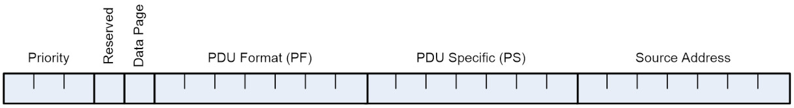
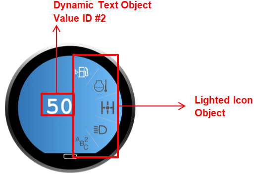

.. autosummary::
   :toctree: generated

SAE J1939
=========

1. Overview
***********

This document describes the functionality and communication of the
Grayhill Touch Encoder product.

1.1 Reference Documents
-----------------------

The following documents are referenced within this document.

-  SAE-J1939
-  SAE-J1939/11
-  SAE-J1939/21
-  SAE-J1939/71
-  SAE-J1939/81

2. J1939 Communications
***********************

2.1 Message Header Description
------------------------------

The figure below illustrates the format of the CAN message ID. A brief
description of each field follows.

   j1939-can-id
   
2.1.1 Priority
~~~~~~~~~~~~~~

This 3-bit field is used to define the priority during arbitration. 0 is
the highest priority and is usually associated with high-speed control
messages. Low priority is used for non-critical configuration and
information messages. The lowest priority value is 7.

2.1.2 Data Page (DP)
~~~~~~~~~~~~~~~~~~~~

This 1-bit field defines on which data page (0 or 1) the message is
defined in the J1939 specification. Page 0 contains the messages that
are presently defined, while Page 1 is for future expansion according to
J1939.

2.1.3 Protocol Data Unit (PDU) - PDU Format (PF)
~~~~~~~~~~~~~~~~~~~~~~~~~~~~~~~~~~~~~~~~~~~~~~~~

This 8-bit field determines the format of the message and is one of the
fields which determine the Parameter Group Number of the message (see
2.1.6). If the value is between 0 and 239, the message is a PDU 1 format
message. These messages are sent to specific addresses. If the value is
between 240 and 255, the message is a PDU 2 format message. These
messages are not sent to a specific address, but are instead broadcast
to the entire network.

2.1.4 Protocol Data Unit (PDU) - PDU Specific (PS)
~~~~~~~~~~~~~~~~~~~~~~~~~~~~~~~~~~~~~~~~~~~~~~~~~~

The PDU Specific (PS) field is the Destination Address (DA) in a PDU 1
Format. In a PDU 2 format the PS becomes the Group Extension (GE). This
field is 8 bits long.

2.1.5 Source Address
~~~~~~~~~~~~~~~~~~~~

This 8-bit field is the source address of the device that sent the
message.

2.1.6 Parameter Group Number
~~~~~~~~~~~~~~~~~~~~~~~~~~~~

J1939 defines allowable messages by their Parameter Group Number (PGN).
The Parameter Group Number is an 18-bit value that uniquely defines the
message purpose. It is composed of the Reserved bit, DP, PF and PS, all
of which are described above.

2.2 J1939 Bit Field Location and Byte Ordering
----------------------------------------------

The first data byte is sent first and is referenced as Byte 1. The LSB
of the data bytes are on the right and are referenced as Bit 1.

All multibyte data fields are specified in little-endian byte order
unless stated otherwise.

The convention used to locate a parameter in the data field is the same
as specified in SAE-J1939/71. The format used is "R.x" where R is the
byte number and x is the starting bit number within the byte. The length
is the number of bits starting at this point.

**Example**: Location 4.3 with a length of 3 bits would have the value
of 1 as illustrated below.

    Byte 4 = 0x67 = 0b011\ **001**\ 11. The bold value is the three bit
    field holding a value of 0b001.

**Example**: Location 4.3 with a length of 3 bits would have the value
of 6 as illustrated below.

    Byte 4 = 0x7b = 0b011\ **110**\ 11. The bold value is the three bit
    field holding a value of 0b110.

2.3 Grayhill Touch Encoder Source Address
-----------------------------------------

The source address of the Grayhill Touch Encoder device is set to 242
(0xF2) at the factory. This may be modified dynamically with the
proprietary Source Address Command. The source address value is stored
in non-volatile memory. Touch Encoder assumes this value at startup but
the actual source address is the result of Dynamic Addressing. Multiple
Touch Encoder devices can coexist in the same system.

2.4 Standard Messages
---------------------

The Events Data message and the Widget Data message all use the
Proprietary B PDU2 format (PF = 255) that broadcasts to no specific
address the status of the device. The Control Data message uses
Proprietary A PDU1 format (PF = 239).

2.4.1 Events Data Message
~~~~~~~~~~~~~~~~~~~~~~~~~

::

    Priority – 0b110 (6)
    R/DP – 0b00 (0)
    PF – 0xFF (255), Proprietary B PDU2 Format
    GrpExt – 0x0F (15)
    SrcAddr – 0xF2 (242), i.e. Touch Encoder default source address
    ID – 0x18FF0FF2
    Direction – Transmit
    Data Length – 8 bytes
    Transmission Rate – On Event (programmable)

\* The Events Data PGN can be reassigned using a configuration command.

+-------+---------+--------------------+---------------------------------------------------------+
| Start | Length  | Desc.              | Values                                                  |
+=======+=========+====================+=========================================================+
| 1.1   | 8 bits  | Screen Number      | 0x01 – Screen #1 at the time ofevent                   |
+-------+---------+--------------------+---------------------------------------------------------+
|       |         |                    | ...                                                     |
+-------+---------+--------------------+---------------------------------------------------------+
|       |         |                    | 0xFF – Screen #255 at the time of event                |
+-------+---------+--------------------+---------------------------------------------------------+
| 2.1   | 8 bits  | Reserved           | Reserved for future use                                 |
+-------+---------+--------------------+---------------------------------------------------------+
| 3.1   | 8 bits  | Event ID           | 0x01- Events: Standard (Relative Encoder, Taps, Swipes) |
+-------+---------+--------------------+---------------------------------------------------------+
| 4.1   | 8 bits  | Encoder (relative) | 0x80 – No Change                                       |
+-------+---------+--------------------+---------------------------------------------------------+
|       |         |                    | 0x81 – Clockwise 1 detent                              |
+-------+---------+--------------------+---------------------------------------------------------+
|       |         |                    | 0x82 – Clockwise 2 detents                             |
+-------+---------+--------------------+---------------------------------------------------------+
|       |         |                    | ...                                                     |
+-------+---------+--------------------+---------------------------------------------------------+
|       |         |                    | 0xFE – Clockwise 126 detents                           |
+-------+---------+--------------------+---------------------------------------------------------+
|       |         |                    | 0x7F – Counter-Clockwise 1 detent                      |
+-------+---------+--------------------+---------------------------------------------------------+
|       |         |                    | 0x7E – Counter-Clockwise 2 detents                     |
+-------+---------+--------------------+---------------------------------------------------------+
|       |         |                    | ...                                                     |
+-------+---------+--------------------+---------------------------------------------------------+
|       |         |                    | 0x01 – Counter-Clockwise 127 detents                   |
+-------+---------+--------------------+---------------------------------------------------------+
|       |         |                    | 0x00 – Not used                                        |
+-------+---------+--------------------+---------------------------------------------------------+
|       |         |                    | 0xFF – Not used                                        |
+-------+---------+--------------------+---------------------------------------------------------+
| 5.1   | 16 bits | Tap Mask*          | 0x0000 – No Tap detected                               |
+-------+---------+--------------------+---------------------------------------------------------+
|       |         |                    | 0x0001 – Tap in Zone 1 detected                        |
+-------+---------+--------------------+---------------------------------------------------------+
|       |         |                    | 0x0002 – Tap in Zone 2 detected                        |
+-------+---------+--------------------+---------------------------------------------------------+
|       |         |                    | 0x0004 – Tap in Zone 3 detected                        |
+-------+---------+--------------------+---------------------------------------------------------+
|       |         |                    | ...                                                     |
+-------+---------+--------------------+---------------------------------------------------------+
|       |         |                    | 0x4000 – Tap in Zone 15 detected                       |
+-------+---------+--------------------+---------------------------------------------------------+
|       |         |                    | 0x8000 – Tap on screen (anywhere) detected             |
+-------+---------+--------------------+---------------------------------------------------------+
|       |         |                    | ...                                                     |
+-------+---------+--------------------+---------------------------------------------------------+
| 7.1   | 8 bits  | Swipe Mask         | 0x00 – No Swipe detected                               |
+-------+---------+--------------------+---------------------------------------------------------+
|       |         |                    | 0x01 – Swipe Up detected                               |
+-------+---------+--------------------+---------------------------------------------------------+
|       |         |                    | 0x02 – Swipe Down detected                             |
+-------+---------+--------------------+---------------------------------------------------------+
|       |         |                    | 0x04 – Swipe Left detected                             |
+-------+---------+--------------------+---------------------------------------------------------+
|       |         |                    | 0x08 – Swipe Right detected                            |
+-------+---------+--------------------+---------------------------------------------------------+
|       |         |                    | 0x80 – Swipe (any direction) detected                  |
+-------+---------+--------------------+---------------------------------------------------------+
|       |         |                    | \* This field is specified in big-endian byte order.     |
+-------+---------+--------------------+---------------------------------------------------------+

The Events Data message is sent to inform the receiving (host) ECU of
any new events (encoder turn, tap or swipe) that occurred on the Touch
Encoder. If such an event causes a screen transistion or change to any
of the current widgets Value IDs, the Event Data Message is followed by
Widget Data message(s).

**Example**: Turning the encoder counter-clockwise by 2 detents on
screen 1 (since last message) will result in the following message being
transmitted.

::

    ID=0x18FF0FF2, LEN=8, DATA=0x01,0x00,0x01,0x7E,0x00,0x00,0x00,0xFF

**Example**: Swiping up on the touch pad on screen 5 will result in the
following message being transmitted.

::

    ID=0x18FF0FF2, LEN=8, DATA=0x05,0x00,0x01,0x80,0x00,0x00,0x81,0xFF

**Example**: Tapping in screen 10 zone 4 of the touch pad will result in
the following message being transmitted.

::

    ID=0x18FF0FF2, LEN=8, DATA=0x0A,0x00,0x01,0x80,0x80,0x08,0x00,0xFF

2.4.2 Widget Data Message
~~~~~~~~~~~~~~~~~~~~~~~~~

::

    Priority – 0b110 (6)
    R/DP – 0b00 (0)
    PF – 0xFF (255), Proprietary B PDU2 Format
    GrpExt – 0x11 (17)
    SrcAddr – 0xF2 (242), i.e. Touch Encoder default source address
    ID – 0x18FF11F2
    Direction – Transmit
    Data Length – 8 bytes
    Transmission Rate – On Event (programmable)

\* The Widget Data PGN can be reassigned using a configuration command.

As described in the previous section, if an event on the Touch Encoder
Device or Modify Widget Data Message causes a new widget to be displayed
or if the event causes a change in one of the active Value IDs on the
current widget, the Events Data message is immediately followed by
Widget Data message(s).

For events or Modify Widget Data Messages that cause a screen
transistion, Widget Reports for all active values IDs (i.e., value IDs
configured to be used) on that widget will be sent. For events or Modify
Widget Messages that cause a value change on the current widget, Widget
Reports for only the changed values will be sent.

Due to CAN restrictions on the number of data bytes allowed per CAN
frame, Widget Data Reports with multiple Value IDs need to be split up
into several messages. The number of messages needed is equal to the
number of Value IDs that need reporting. For instance, when
tranistioning to a screen with a single active Value ID, only one
message is needed. When transistioning to a screen with multiple active
Value IDs, multiple messages are sent out consecutively for each active
Value ID on that widget.

+---------+-----------+---------------------------+----------------------------------------------------------------+
| Start   | Length    | Desc.                     | Values                                                         |
+=========+===========+===========================+================================================================+
| 1.1     | 8 bits    | Screen Number             | 0x01 – Screen #1 currently being displayed                     |
+---------+-----------+---------------------------+----------------------------------------------------------------+
|         |           |                           | …                                                              |
+---------+-----------+---------------------------+----------------------------------------------------------------+
|         |           |                           | 0xFF – Screen #255 currently being displayed                   |
+---------+-----------+---------------------------+----------------------------------------------------------------+
| 2.1     | 8 bits    | Reserved                  | Reserved for future use                                        |
+---------+-----------+---------------------------+----------------------------------------------------------------+
| 3.1     | 8 bits    | Value ID                  | 0x00 – No Values on this screen                                |
+---------+-----------+---------------------------+----------------------------------------------------------------+
|         |           |                           | 0x01 – Value ID #1                                             |
+---------+-----------+---------------------------+----------------------------------------------------------------+
|         |           |                           | 0x02 – Value ID #2                                             |
+---------+-----------+---------------------------+----------------------------------------------------------------+
|         |           |                           | 0x04 – Value ID #3                                             |
+---------+-----------+---------------------------+----------------------------------------------------------------+
|         |           |                           | …                                                              |
+---------+-----------+---------------------------+----------------------------------------------------------------+
|         |           |                           | 0x80 – Value ID #8                                             |
+---------+-----------+---------------------------+----------------------------------------------------------------+
| 4.1     | 16 bits   | Current Value             | Value currently being displayed for the given Value ID         |
+---------+-----------+---------------------------+----------------------------------------------------------------+
| 6.1     | 4 bits    | Reserved                  | 0                                                              |
+---------+-----------+---------------------------+----------------------------------------------------------------+
| 6.5     | 4 bits    | Display Code              | Display Code (Decimal Code) for this Value                     |
+---------+-----------+---------------------------+----------------------------------------------------------------+
| 7.1     | 8 bits    | Active Value ID Bitmask   | Mask for active/configured IDs on current widget. On screen    |
+---------+-----------+---------------------------+----------------------------------------------------------------+
|         |           |                           | change all active IDs will be set. On single ID change only    |
+---------+-----------+---------------------------+----------------------------------------------------------------+
|         |           |                           | that ID will be set.                                           |
+---------+-----------+---------------------------+----------------------------------------------------------------+
|         |           |                           | 0x00 – Not used                                                |
+---------+-----------+---------------------------+----------------------------------------------------------------+
|         |           |                           | 0x01 – Value ID (Value #1 is active for this screen)           |
+---------+-----------+---------------------------+----------------------------------------------------------------+
|         |           |                           | 0x02 – Value ID (Value #2 is active for this screen)           |
+---------+-----------+---------------------------+----------------------------------------------------------------+
|         |           |                           | 0x03 – Value ID (Value #1 and #2 are active for this screen)   |
+---------+-----------+---------------------------+----------------------------------------------------------------+
|         |           |                           | …                                                              |
+---------+-----------+---------------------------+----------------------------------------------------------------+
|         |           |                           | 0xFF – Value ID (All 8 Values active for this widget)          |
+---------+-----------+---------------------------+----------------------------------------------------------------+

**Example**: For two active Value IDs, two separate messages are needed
to convey all of the Widget information. Below is an example of the
messages sent when transitioning to a widget that has two ValueIDs. The
first being a temperature setting of 75 and the second being a fan speed
of 5.

::

    ID=0x18FF11F2, LEN=8, DATA=0x01,0x00,0x01,0x4B,0x00,0x00,0x03,0xFF

    ID=0x18FF11F2, LEN=8, DATA=0x01,0x00,0x02,0x05,0x00,0x00,0x03,0xFF

2.4.3 Configuration and Control Message
~~~~~~~~~~~~~~~~~~~~~~~~~~~~~~~~~~~~~~~

::

    Priority – 0b110 (6)
    R/DP – 0b00 (0)
    PF – 0xEF (239) Proprietary A PDU1 Format
    PS – DestAddr, i.e. address of the Touch Encoder device, default value: 242 (0xF2)
    SrcAddr – 0x21 (33), i.e. example source address
    ID – 0x18EFF221
    Direction – Receive
    Data Length – 8

+-------+---------+-----------------------------------+-------------------------------------+
| Start | Length  | Desc.                             | Values                              |
+=======+=========+===================================+=====================================+
| 1.1   | 1 Byte  | Configuration and Control Command | Command Byte as described in sec. 3 |
+-------+---------+-----------------------------------+-------------------------------------+
| 2.1   | 7 Bytes | Configuration and Control Data    | Variable as described in sec. 3     |
+-------+---------+-----------------------------------+-------------------------------------+

3. Configuration and Control Commands
*************************************

Changing of the configuration and how the Touch Encoder device behaves
is done with the Configuration and Control message described in section
2.4.3. The first byte serves as the command byte. Where applicable,
changes take effect immediately and are stored in non-volatile memory
unless otherwise noted.

The header information for these commands is as follows:

::

    Priority – 0b110 (6)
    R/DP – 0b00 (0)
    PF – 0xEF (239)
    PS – DestAddr, i.e. address of the Touch Encoder device, default value: 0xF2 (242)
    SrcAddr – 0x21 (33), i.e. example source address
    ID – 0x18EFF221, Proprietary A PDU1 Format
    Direction – Receive

3.1 Modify Widget Data
----------------------

Data Length – 7 bytes

+-------+---------+------------------------------+------------------------------------------------------------------------------------+
| Start | Length  | Desc.                        | Values                                                                             |
+=======+=========+==============================+====================================================================================+
| 1.1   | 8 bits  | Command                      | 0x11 – Force Widget Data                                                          |
+-------+---------+------------------------------+------------------------------------------------------------------------------------+
| 2.1   | 8 bits  | Screen Number                | 0x00 – Screen #0 to be displayed                                                  |
+-------+---------+------------------------------+------------------------------------------------------------------------------------+
|       |         |                              | 0x01 – Screen #1 to be displayed                                                  |
+-------+---------+------------------------------+------------------------------------------------------------------------------------+
|       |         |                              | …                                                                                 |
+-------+---------+------------------------------+------------------------------------------------------------------------------------+
|       |         |                              | 0xFF – Screen #255 to be displayed                                                |
+-------+---------+------------------------------+------------------------------------------------------------------------------------+
| 3.1   | 8 bits  | Value ID                     | 0x00 – No altered Values                                                          |
+-------+---------+------------------------------+------------------------------------------------------------------------------------+
|       |         |                              | 0x01 – Value ID #1                                                                |
+-------+---------+------------------------------+------------------------------------------------------------------------------------+
|       |         |                              | 0x02 – Value ID #2                                                                |
+-------+---------+------------------------------+------------------------------------------------------------------------------------+
|       |         |                              | 0x04 – Value ID #3                                                                |
+-------+---------+------------------------------+------------------------------------------------------------------------------------+
|       |         |                              | …                                                                                 |
+-------+---------+------------------------------+------------------------------------------------------------------------------------+
|       |         |                              | 0x80 – ValueID #8                                                                 |
+-------+---------+------------------------------+------------------------------------------------------------------------------------+
| 4.1   | 16 bits | Current Value                | Value to be displayed. This value is of the format specified by Display Code value |
+-------+---------+------------------------------+------------------------------------------------------------------------------------+
| 6.1   | 1 bit   | Screen Transition Suppressor | 0 – Perform screen transition                                                     |
+-------+---------+------------------------------+------------------------------------------------------------------------------------+
|       |         |                              | 1 – Suppress screen transition                                                    |
+-------+---------+------------------------------+------------------------------------------------------------------------------------+
| 6.2   | 3 bits  | Reserved                     | 0                                                                                  |
+-------+---------+------------------------------+------------------------------------------------------------------------------------+
| 6.5   | 4 bits  | Display Code                 | Display Code for this Value (Decimal Code)                                         |
+-------+---------+------------------------------+------------------------------------------------------------------------------------+
| 7.1   | 8 bits  | Active Value ID Bitmask      | 0x00 – Not used                                                                   |
+-------+---------+------------------------------+------------------------------------------------------------------------------------+
|       |         |                              | 0x01 – Value #1 currently active                                                  |
+-------+---------+------------------------------+------------------------------------------------------------------------------------+
|       |         |                              | 0x02 – Value #2 currently active                                                  |
+-------+---------+------------------------------+------------------------------------------------------------------------------------+
|       |         |                              | …                                                                                 |
+-------+---------+------------------------------+------------------------------------------------------------------------------------+
|       |         |                              | 0x80 – All 8 Values currently active                                              |
+-------+---------+------------------------------+------------------------------------------------------------------------------------+

**Example**: Sending the following message to a Touch Encoder device
having the default address of 0xF2 will set the current screen to be
displayed to 0x03 and the current value of ValueID #2 of that screen to
0x01F4.

::

    ID=18EFF221, LEN=8, Data=0x11, 0x03, 0x02, 0xF4, 0x01, 0x00, 0x02, 0xFF

3.1.1 Multi-Value Data Example
~~~~~~~~~~~~~~~~~~~~~~~~~~~~~~

   multi-value-widget
**Example**: The figure above displays an example of a multi-value
widget. The dynamic text object is designated at Value ID #2. The
lighted icon object is designated as Value ID #3. Below is the sequence
of messages to turn on the top lighted icon and change the dynamic text
to 100.

::

    ID=18EFF221, LEN=8, Data=0x11, 0x03, 0x04, 0x01, 0x00, 0x00, 0x06, 0xFF

    ID=18EFF221, LEN=8, Data=0x11, 0x03, 0x02, 0x64, 0x00, 0x00, 0x06, 0xFF

3.1.2 Display Code
~~~~~~~~~~~~~~~~~~

The Display Code gives the Touch Encoder the ability to display decimal
numbers. The Display Code occupies 4 upper bits of byte 6. The value of
this field is interpreted as a signed 4-bit integer that specifies the
direction and the amount of decimal places to shift the point by. The
alternative name for this field is Decimal Code. The table below
describes how the decimal code works.

+--------------+-------+---------------+--------------------------------------+
| Decimal Code | Value | Display Value | Description                          |
+==============+=======+===============+======================================+
| 0x0          | 1     | 1             | Display value directly               |
+--------------+-------+---------------+--------------------------------------+
| 0x1          | 1     | 10            | value x 10 (shift right one place)   |
+--------------+-------+---------------+--------------------------------------+
| 0x2          | 1     | 100           | value x 100 (shift right two places) |
+--------------+-------+---------------+--------------------------------------+
| 0xE          | 1     | 0.01          | value ÷ 100 (shift left two places) |
+--------------+-------+---------------+--------------------------------------+
| 0xF          | 1     | 0.1           | value ÷ 10 (shift left one place)   |
+--------------+-------+---------------+--------------------------------------+

3.1.3 Screen Transition Suppression
~~~~~~~~~~~~~~~~~~~~~~~~~~~~~~~~~~~

The Screen Transition Suppressor (STS) enables the Touch Encoder to
modify variable data of the target screen without first transitioning to
that screen. If the corresponding bit is set, the Touch Encoder will not
perform a screen transition prior to applying a data change. This
feature is available in Touch Encoder firmware version 3.1.0 or higher.

3.2 Modify Events Data PGN
--------------------------

Data Length – 8 bytes

+--------+--------+--------+--------+--------+--------+--------+--------+
| Byte 1 | Byte 2 | Byte 3 | Byte 4 | Byte 5 | Byte 6 | Byte 7 | Byte 8 |
+========+========+========+========+========+========+========+========+
| 0xD1   | aa     | bb     | xx     | xx     | xx     | 0x55   | 0xAA   |
+--------+--------+--------+--------+--------+--------+--------+--------+

| **aa** – The least significant byte of the new PGN. Valid Range:
0..255
| **bb** - The most significant byte of the new PGN. Valid Range: 0..255
| **xx** – Don't Care. Should be 0xFF following J1939 convention
| **0x55** – Low byte of 16 bit key
| **0xAA** – High byte of 16 bit key

3.3 Modify Events Data Transmission Period
------------------------------------------

Data Length – 8 bytes

+--------+--------+--------+--------+--------+--------+--------+--------+
| Byte 1 | Byte 2 | Byte 3 | Byte 4 | Byte 5 | Byte 6 | Byte 7 | Byte 8 |
+========+========+========+========+========+========+========+========+
| 0xD3   | dd     | Event  | xx     | xx     | xx     | 0x55   | 0xAA   |
+--------+--------+--------+--------+--------+--------+--------+--------+

| **dd** – specifies transmission period. Valid range is 0..255. The
actual period is determined by multiplying the value by 10ms. This
yields the minimum of 10ms and the maximum of 2.55 seconds. The value of
0 turns off periodic transmission of the message.
| **Event** – transmit on event. Valid values are 0 and 1. The value of
1 sends the message upon state change. The value of 0 will cause the
message to be transmitted only at the specified time interval unless
also set to 0.
| **xx** – Don't Care. Should be 0xFF following J1939 convention
| **0x55** – Low byte of 16 bit key
| **0xAA** – High byte of 16 bit key

3.4 Modify Widgets Data PGN
---------------------------

Data Length – 8 bytes

+--------+--------+--------+--------+--------+--------+--------+--------+
| Byte 1 | Byte 2 | Byte 3 | Byte 4 | Byte 5 | Byte 6 | Byte 7 | Byte 8 |
+========+========+========+========+========+========+========+========+
| 0xD9   | aa     | bb     | xx     | xx     | xx     | 0x55   | 0xAA   |
+--------+--------+--------+--------+--------+--------+--------+--------+

| **aa** – The least significant byte of the new PGN. Valid Range:
0..255
| **bb** - The most significant byte of the new PGN. Valid Range: 0..255
| **xx** – Don't Care. Should be 0xFF following J1939 convention
| **0x55** – Low byte of 16 bit key
| **0xAA** – High byte of 16 bit key

3.5 Modify Widgets Data Transmission Period
-------------------------------------------

Data Length – 8 bytes

+--------+--------+--------+--------+--------+--------+--------+--------+
| Byte 1 | Byte 2 | Byte 3 | Byte 4 | Byte 5 | Byte 6 | Byte 7 | Byte 8 |
+========+========+========+========+========+========+========+========+
| 0xDB   | dd     | Event  | xx     | xx     | xx     | 0x55   | 0xAA   |
+--------+--------+--------+--------+--------+--------+--------+--------+

| **dd** – specifies transmission period. Valid range is 0..255. The
actual period is determined by multiplying the value by 10ms. This
yields the minimum of 10ms and the maximum of 2.55 seconds. The value of
0 turns off periodic transmission of the message.
| **Event** – transmit on event. Valid values are 0 and 1. The value of
1 sends the message upon state change. The value of 0 will cause the
message to be transmitted only at the specified time interval unless
also set to 0.
| **xx** – Don't Care. Should be 0xFF following J1939 convention
| **0x55** – Low byte of 16 bit key
| **0xAA** – High byte of 16 bit key

3.6 Modify Message Priority
---------------------------

Data Length – 8 bytes

+--------+--------+--------+--------+--------+--------+--------+--------+
| Byte 1 | Byte 2 | Byte 3 | Byte 4 | Byte 5 | Byte 6 | Byte 7 | Byte 8 |
+========+========+========+========+========+========+========+========+
| 0xD2   | dd     | xx     | xx     | xx     | xx     | 0x55   | 0xAA   |
+--------+--------+--------+--------+--------+--------+--------+--------+

| **dd** – The new priority. Valid Range: 0..7
| **xx** – Don't Care. Should be 0xFF following J1939 convention
| **0x55** – Low byte of 16 bit key
| **0xAA** – High byte of 16 bit key

Applies to all messages sent by the Touch Encoder.

3.7 Modify Source Address
~~~~~~~~~~~~~~~~~~~~~~~~~

Data Length – 8 bytes

+--------+--------+--------+--------+--------+--------+--------+--------+
| Byte 1 | Byte 2 | Byte 3 | Byte 4 | Byte 5 | Byte 6 | Byte 7 | Byte 8 |
+========+========+========+========+========+========+========+========+
| 0xE0   | dd     | xx     | xx     | xx     | xx     | 0x55   | 0xAA   |
+--------+--------+--------+--------+--------+--------+--------+--------+

| **dd** – Has a value between 128 and 245 and is the new source address
| **xx** – Don't Care. Should be 0xFF following J1939 convention
| **0x55** – Low byte of 16 bit key
| **0xAA** – High byte of 16 bit key

3.8 Backlight Intensity
-----------------------

Data Length – 8 bytes

+--------+--------+--------+--------+--------+--------+--------+--------+
| Byte 1 | Byte 2 | Byte 3 | Byte 4 | Byte 5 | Byte 6 | Byte 7 | Byte 8 |
+========+========+========+========+========+========+========+========+
| 0x80   | xx     | dd     | xx     | xx     | xx     | xx     | xx     |
+--------+--------+--------+--------+--------+--------+--------+--------+

| **dd** – Has a value between 0 and 100 and is the percentage of
backlight intensity
| **xx** – Don't Care. Should be 0xFF following J1939 convention

3.9 Live Update Request
-----------------------

Data Length – 8 bytes

+-------+---------+----------------+-----------------------------------------+
| Start | Length  | Desc.          | Values                                  |
+=======+=========+================+=========================================+
| 1.1   | 1 Byte  | Command        | 0x55 - Live Update Request              |
+-------+---------+----------------+-----------------------------------------+
| 2.1   | 1 Byte  | Component type | 0 - package                             |
+-------+---------+----------------+-----------------------------------------+
|       |         |                | 3 - project                             |
+-------+---------+----------------+-----------------------------------------+
| 3.1   | 3 Bytes | Upload Size    | File size in bytes                      |
+-------+---------+----------------+-----------------------------------------+
| 6.1   | 3 Bytes | PGN            | PGN value to use for the update session |
+-------+---------+----------------+-----------------------------------------+

**Example**: The following message requests the update of Touch Encoder
project. The origin (0x21) obligates itself to upload a file of size
equal to 2212495 bytes (roughly 2.11MB) over PGN 0x13300. The file, once
succesfully submitted, will be used to update the TE project.

::

    ID=18EFF221, LEN=8, Data=0x55, 0x03, 0x8F, 0xC2, 0x21, 0x00, 0x33, 0x01

To learn more about the live update procedure, see our `Live Update
guide <../live_update.md>`__.

4. Other J1939 Messages
***********************

The following messages are defined in the J1939 documents and are
implemented in the Touch Encoder device.

4.1 Address Claimed
-------------------

::

    Priority – 0b110 (6)
    R/DP – 0b00 (0)
    PF – 0xEE (238), Address Claimed
    PS – DestAddr, address should always be the Global Address, 0xFF
    SrcAddr – 0xF2 (242), i.e. Touch Encoder source address
    ID – 0x18EEFFF2, Proprietary A PDU1 Format
    Direction – Transmit
    Data Length – 8 bytes
    Transmission Rate – Upon boot or whenever requested

+-------+---------+---------------------------+-----------------------------------+
| Start | Length  | Desc.                     | Values                            |
+=======+=========+===========================+===================================+
| 1.1   | 21 Bits | Identity Number           | Device-unique value               |
+-------+---------+---------------------------+-----------------------------------+
| 3.6   | 11 Bits | Manufacturers Code        | 294 (Assigned to Grayhill by SAE) |
+-------+---------+---------------------------+-----------------------------------+
| 5.1   | 3 Bits  | ECU Instance              | 0 (Default)                       |
+-------+---------+---------------------------+-----------------------------------+
| 5.4   | 5 Bits  | Function Instance         | 0 (Default)                       |
+-------+---------+---------------------------+-----------------------------------+
| 6.1   | 8 Bits  | Function                  | 60 (Cab Display) \*               |
+-------+---------+---------------------------+-----------------------------------+
| 7.1   | 1 Bit   | Reserved                  | 0 (Defined by SAE)                |
+-------+---------+---------------------------+-----------------------------------+
| 7.2   | 7 Bits  | Vehicle System            | 0 (Default)                       |
+-------+---------+---------------------------+-----------------------------------+
| 8.1   | 4 Bits  | Vehicle System Instance   | 0 (Default)                       |
+-------+---------+---------------------------+-----------------------------------+
| 8.5   | 3 Bits  | Industry Group            | 0 Global (Default)                |
+-------+---------+---------------------------+-----------------------------------+
| 8.8   | 1 Bit   | Arbitrary Address Capable | 1 Capable (Default)               |
+-------+---------+---------------------------+-----------------------------------+

\*Refer to J1939 base document for the Function value based on the
Industry Group and Vehicle System combinations

4.2 PGN Request
---------------

::

    Priority – 0b110 (6)
    R/DP – 0b00 (0)
    PF – 0xEA (234), PGN Request, Proprietary A PDU1 Format
    PS – DestAddr, address of the Touch Encoder device to respond or the Global Address
    SrcAddr – 0x21 (33), i.e. example source address
    ID – 0x18EAF221
    Direction –  Receive
    Data Length – 3

+-------+--------+-------------------------------------+----------+
| Start | Length | Desc.                               | Values   |
+=======+========+=====================================+==========+
| 1     | 1 Byte | Byte 1 of PGN being requested (LSB) | 0 to 255 |
+-------+--------+-------------------------------------+----------+
| 2     | 1 Byte | Byte 2 of PGN being requested       | 0 to 255 |
+-------+--------+-------------------------------------+----------+
| 3     | 1 Byte | Byte 3 of PGN being requested (MSB) | 0        |
+-------+--------+-------------------------------------+----------+

The following are the supported PGN's that can be requested from the
Touch Encoder. If the request is unsupported, the device responds with a
NACK (Refer to J1939-21).

4.2.1 ECU Identification Information (COMING SOON)
~~~~~~~~~~~~~~~~~~~~~~~~~~~~~~~~~~~~~~~~~~~~~~~~~~

::

    Priority – 0b110 (6)
    R/DP – 0b00 (0)
    PF – 0xFD (253), ECU ID, Proprietary B PDU2 Format
    PS – 0xC5 (197)?
    SrcAddr – 0xF2 (242), i.e. Touch Encoder source address
    ID – 0x18FDC5F2
    Direction – Transmit
    Data Length – Variable
    Transmission Rate – Upon Request
    Multi Packet Transerred – Yes, BAM only

+------------+----------+---------------------+--------------------+
| Start      | Length   | Desc.               | Values \*          |
+============+==========+=====================+====================+
| 1          | <=64     | ECU Part Number     | Ex. "3KYY1001-1"   |
+------------+----------+---------------------+--------------------+
| Variable   | <=64     | ECU Serial Number   | Ex. "123456"       |
+------------+----------+---------------------+--------------------+
| Variable   | <=64     | ECU Location        | Ex. "CAB"          |
+------------+----------+---------------------+--------------------+
| Variable   | <=64     | ECU Type            | Ex. "KEYPAD"       |
+------------+----------+---------------------+--------------------+

\*All fields "\*" ASCII delimited

4.2.2 Software Identification
~~~~~~~~~~~~~~~~~~~~~~~~~~~~~

::

    Priority – 0b110 (6)
    R/DP – 0b00 (0)
    PF – 0xFE (254), SW ID, Proprietary B PDU2 Format
    PS – 0xDA (218)
    SrcAddr – 0xF2 (242), i.e. Touch Encoder source address
    ID – 0x18FEDAF2
    Direction – Transmit
    Data Length – Variable, 13-100 bytes
    Transmission Rate – Upon Request
    Multi Packet Transferred – Yes, BAM only

+----------+-----------+-------------------------------------------------------------+----------------------------------+
| Start    | Length    | Desc.                                                       | Values                           |
+==========+===========+=============================================================+==================================+
| 1        | 1 Byte    | Number of software fields                                   | 2 (FW & bootloader only)         |
+----------+-----------+-------------------------------------------------------------+----------------------------------+
|          |           |                                                             | 3 (TE Project version available) |
+----------+-----------+-------------------------------------------------------------+----------------------------------+
| 2        | 5-N Bytes | Firmware version # (Major.Minor.Patch) (ASCII)              | Ex. "4.3.1"                      |
+----------+-----------+-------------------------------------------------------------+----------------------------------+
| Variable | 5-N Bytes | Bootloader version # (Major.Minor.Patch) (ASCII)            | Ex. "7.5.3"                      |
+----------+-----------+-------------------------------------------------------------+----------------------------------+
| Variable | 0-N Bytes | TE Project version # (Major.Minor.Patch) (ASCII) (optional) | Ex. "1.0.1"                      |
+----------+-----------+-------------------------------------------------------------+----------------------------------+

\*All fields "\*" ASCII delimited

4.3 Acknowledgement Message
---------------------------

::

    Priority – 0b110 (6)
    R/DP – 0b00 (0)
    PF – 0xE8 (232), SW ID, Proprietary A PDU1 Format
    PS – 0x22 (34), i.e. example destination address?
    SrcAddr – 0xF2 (242), i.e. Touch Encoder source address
    ID – 0x18E822F2
    Direction – Transmit
    Data Length – 8 bytes
    Priority – 6
    Transmission Rate – Upon appropriate response

+-------+---------+------------------------------------+------------------------------+
| Start | Length  | Desc.                              | Values                       |
+=======+=========+====================================+==============================+
| 1     | 1 Byte  | Control Byte                       | 0 = Positive Acknowledgement |
+-------+---------+------------------------------------+------------------------------+
|       |         |                                    | 1 = Negative Acknowledgement |
+-------+---------+------------------------------------+------------------------------+
|       |         |                                    | 2 = Access Denied            |
+-------+---------+------------------------------------+------------------------------+
|       |         |                                    | 3 = Cannot Respond           |
+-------+---------+------------------------------------+------------------------------+
| 2     | 1 Byte  | Group Function                     | Refer to SAE-J1939-21        |
+-------+---------+------------------------------------+------------------------------+
| 3-5   | 3 Bytes | Reserved by SAE                    |                              |
+-------+---------+------------------------------------+------------------------------+
| 6-8   | 3 Bytes | Parameter Group being Acknowledged |                              |
+-------+---------+------------------------------------+------------------------------+

